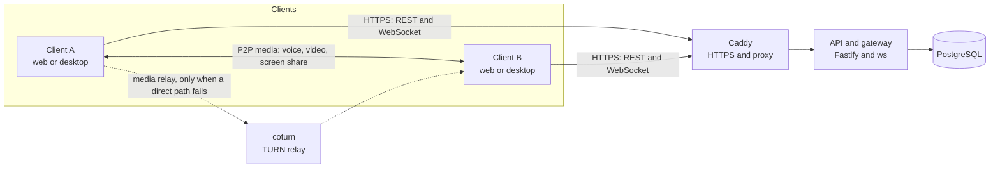

# Mortium

A self-hosted chat and voice app with full end-to-end encryption. It has a
Discord-style layout. Voice and video go directly between the users
(peer-to-peer). One `docker compose up -d` command starts the server on a
home machine.

This is a portfolio project for a small group of friends.

## Features

- **Servers, categories and channels.** Text channels and voice channels.
  Invite links.
- **Text chat.** Markdown, reactions, replies, edits, link previews and
  encrypted file attachments. Local search in the history.
- **Voice, video and screen share.** A peer-to-peer WebRTC mesh for up to
  10 users in one channel. The quality adapts to the network. A TURN relay
  helps when a direct path fails.
- **Friends and direct messages.** Friends, DMs, group DMs and DM calls.
- **Roles and permissions.** Roles, channel overwrites and a permission
  check on the server for every action.
- **End-to-end encryption.** Olm and Megolm (the Matrix protocols) with the
  `vodozemac` library. It has key backup with a recovery key and device
  verification.
- **Desktop apps.** Tauri for Windows and macOS. Electron for Linux. They
  have push to talk, a tray icon, notifications and updates.
- **Home-server deploy.** Docker Compose, automatic HTTPS, TURN and a
  nightly backup.

## Architecture



What the server can see:

- Accounts, guild and channel structure, membership, roles and permissions.
- Who sends an event, in which channel, and when.
- Who is in a voice channel.

What the server cannot see:

- The text of messages, reactions and edits (ciphertext only).
- The bytes of attachments (ciphertext only).
- The voice and video media. It goes between the clients. The TURN relay
  carries encrypted media only when a direct path fails.
- The content of voice signaling (it is encrypted between the devices).
- The search index and the private keys (they stay on the device).

## Security model

- Message content and files are encrypted on the device before they leave
  it. The server stores ciphertext.
- A new device must be verified to read old messages. The user verifies it
  from a different device, or uses the recovery key.
- The specification of the encryption is in
  [`docs/concepts/olm-megolm.md`](docs/concepts/olm-megolm.md).
- The review of the server and the deployment, with the fixes, is in
  [`docs/security-review.md`](docs/security-review.md).
- The design decisions are in [`docs/adr`](docs/adr).

## Tech stack

| Layer | Choice |
| --- | --- |
| Monorepo | pnpm workspaces and Turborepo |
| Server | Node.js, Fastify (REST), `ws` (gateway), zod |
| Database | PostgreSQL 16 and Drizzle ORM |
| Web UI | React 19, Vite, TypeScript, Tailwind, Zustand |
| Client storage | IndexedDB (keys, cache, search index) |
| Encryption | `vodozemac` (Olm and Megolm) as WebAssembly, WebCrypto for files |
| Voice and video | WebRTC mesh, coturn for TURN |
| Desktop | Tauri v2 (Windows, macOS), Electron (Linux) |
| Deploy | Docker Compose, Caddy, coturn, a backup service |
| Tests | Vitest, Playwright, cargo test |
| CI | GitHub Actions |

## Repository layout

| Path | Contents |
| --- | --- |
| `apps/server` | The REST API and the WebSocket gateway |
| `apps/web` | The React UI |
| `apps/desktop-tauri` | The Windows and macOS app |
| `apps/desktop-electron` | The Linux app |
| `packages/shared` | Types, zod schemas and pure functions for the server and the clients |
| `packages/client-core` | Client logic without React: API, gateway, stores, E2EE and voice |
| `packages/crypto-wasm` | The `vodozemac` WebAssembly wrapper |
| `packages/link-preview-fetch` | The safe fetch code for link previews |
| `e2e` | Playwright tests |
| `infra` | Caddy, coturn, backup and development Compose files |
| `scripts` | `generate-secrets.mjs`, which makes a `.env` file |
| `docs` | The documentation (see [`docs/README.md`](docs/README.md)) |

## Run it locally

You need Docker, Node.js (see `.nvmrc`) and pnpm (see `packageManager` in
`package.json`).

1. Copy the environment file.

   ```sh
   cp .env.example .env
   ```

2. Start the database, the TURN server and the mail catcher. Run this from
   the repository root.

   ```sh
   docker compose --env-file .env -f infra/docker-compose.dev.yml up -d
   ```

3. Install the dependencies.

   ```sh
   pnpm i
   ```

4. Start the server and the web app.

   ```sh
   pnpm dev
   ```

5. Open `http://localhost:5173`. The mail catcher shows the account emails
   at `http://localhost:8025`.

## Deploy on a home server

One command starts the full stack on a Linux machine:

```sh
node scripts/generate-secrets.mjs
docker compose up -d --build
```

Set `DOMAIN`, `ACME_EMAIL`, `TURN_EXTERNAL_IP` and the `SMTP_*` values in
`.env` first. The guide has the router ports, dynamic DNS, backups and
hardening steps: [`docs/deploy.md`](docs/deploy.md).

## Tests

| Kind | What it checks | Command |
| --- | --- | --- |
| Lint and types | ESLint and TypeScript | `pnpm lint` and `pnpm typecheck` |
| Unit and integration | Vitest in all packages | `pnpm test` |
| End-to-end | Playwright with real browsers, WebRTC and TURN | `pnpm e2e` |
| Rust | The Tauri shell | `cargo test --locked` in `apps/desktop-tauri/src-tauri` |

The server integration tests need a real Postgres. Set
`TEST_DATABASE_URL` to a user that can create databases. The helper makes
one throwaway database for each test file. Without the variable, these
tests skip and all other tests still run.

```sh
export TEST_DATABASE_URL="postgres://mortium:<password-from-.env>@localhost:5432/postgres"
pnpm test
```

For the end-to-end tests, install the browser one time and start the
development stack:

```sh
pnpm --filter @mortium/e2e exec playwright install chromium
docker compose --env-file .env -f infra/docker-compose.dev.yml up -d
pnpm e2e
```

The CI workflow (`.github/workflows/ci.yml`) has these jobs:

- `build`: lint, type check and unit tests.
- `rust` and `desktop`: Rust tests for the Tauri shell on Linux and Windows.
- `e2e`: the Playwright tests with a coturn container.
- `turn-prod`: the production coturn config, with its peer rules.
- `electron`: builds the deb package and runs a smoke test.
- `production-images`: checks the Compose file and builds the images.

## Desktop apps

Windows and macOS use Tauri. Linux uses Electron, because the Linux
WebView has weak WebRTC support (see
[ADR 0003](docs/adr/0003-tauri-and-electron-linux.md)).

```sh
pnpm --filter @mortium/desktop-tauri build
pnpm --filter @mortium/desktop-electron package
```

The first command makes the Windows installers (and the macOS app on a
Mac). The second command makes the AppImage and the deb package on Linux.

The release workflow (`.github/workflows/release.yml`) runs when CI passes
on a push to main. When the app code changed, it builds all installers and
publishes a new release. The installed apps then update themselves. Read
[`docs/concepts/desktop-shells.md`](docs/concepts/desktop-shells.md) for
the signing keys, the updates and the origin settings.

## Project status and known limits

All milestones up to M9 (documentation and polish) are built.

- Push to talk on Linux Wayland works only while the window has focus.
  Wayland does not let an app read the keys of other apps.
- A screen share on Linux has no system audio.
- Screen share is not available in the macOS app. Use the web app.
- The macOS app is not signed with an Apple Developer ID, and it is not
  tested on a Mac yet. macOS shows a warning at the first start.
- A new device must be verified, or use the recovery key, to read old
  messages.
- The desktop updater needs a public repository. A private repository
  gives no release files without a login, so the update check fails.
- The voice mesh has a cap of 10 users for each channel.

## Screenshots and demos (TODO)

The repository has no images yet. Add these files, then link them here:

- [ ] A screenshot of the main chat view.
- [ ] A screenshot of a voice channel with video tiles.
- [ ] A GIF of a screen share.
- [ ] A screenshot of the device verification dialog.
- [ ] A screenshot of the permissions editor.
